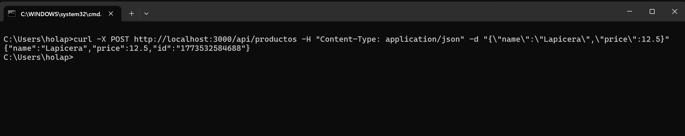
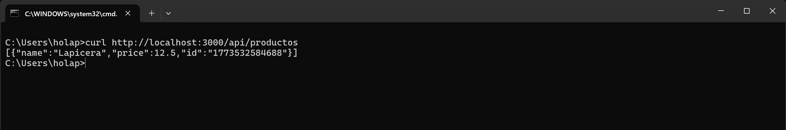
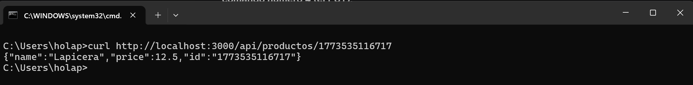
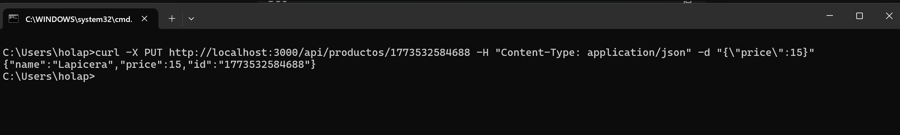

# API REST CRUD - Productos (Práctica 3.2.3)

Esta es una API RESTful desarrollada con Node.js y Express que implementa operaciones CRUD (Crear, Leer, Actualizar, Eliminar) para la gestión de productos. Los datos se almacenan temporalmente en memoria.

## Requisitos e Instalación

1. Clonar o descargar este repositorio.
2. Abrir la terminal en la carpeta del proyecto y ejecutar:
   npm install

3. Levantar el servidor en modo desarrollo:
   npm run dev

El servidor estará corriendo en http://localhost:3000.

## Ejemplos de Peticiones (CMD Windows)
A continuación, se muestran los comandos curl adaptados para la terminal de Windows para probar cada endpoint:

1. Crear un producto (POST):
curl -X POST http://localhost:3000/api/productos -H "Content-Type: application/json" -d "{\"name\":\"Lapicera\",\"price\":12.5}"

2. Listar todos los productos (GET):
curl http://localhost:3000/api/productos

3. Obtener un producto por ID (GET):
(Reemplazar <id> por el ID generado en el paso 1)

curl http://localhost:3000/api/productos/<id>

4. Actualizar un producto (PUT):

curl -X PUT http://localhost:3000/api/productos/<id> -H "Content-Type: application/json" -d "{\"price\":15}"

5. Eliminar un producto (DELETE):

curl -X DELETE http://localhost:3000/api/productos/<id>

